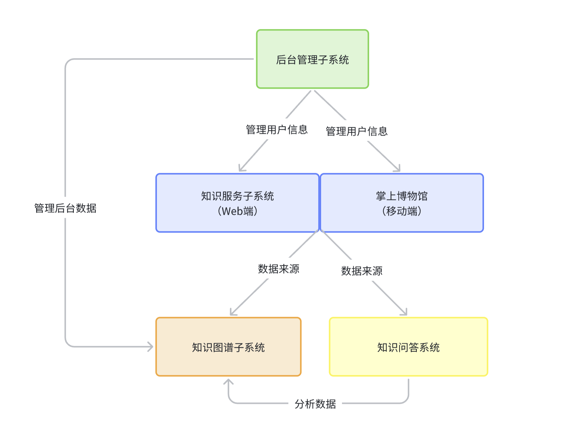
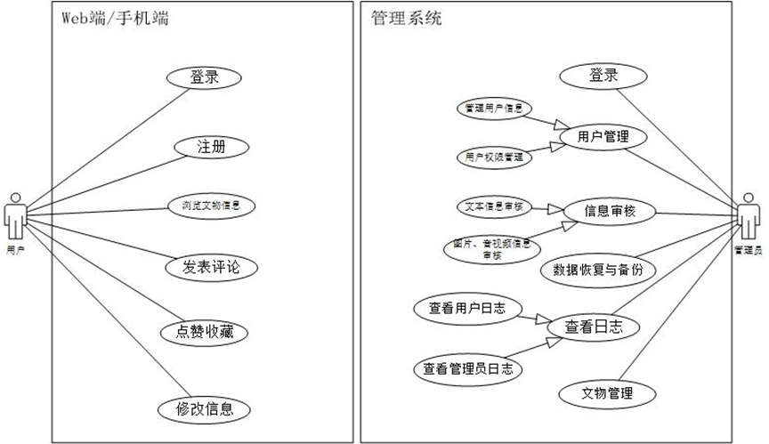
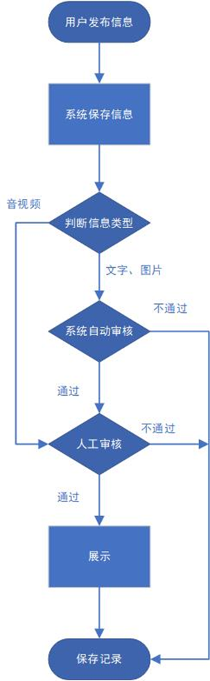
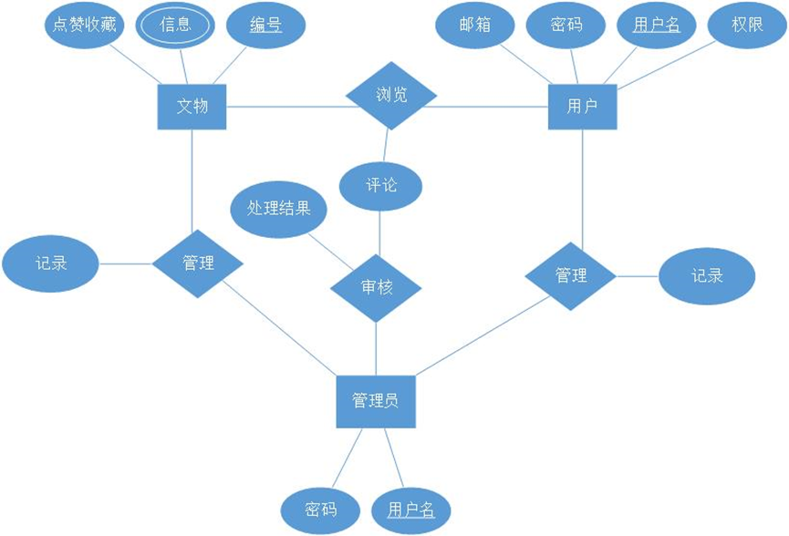
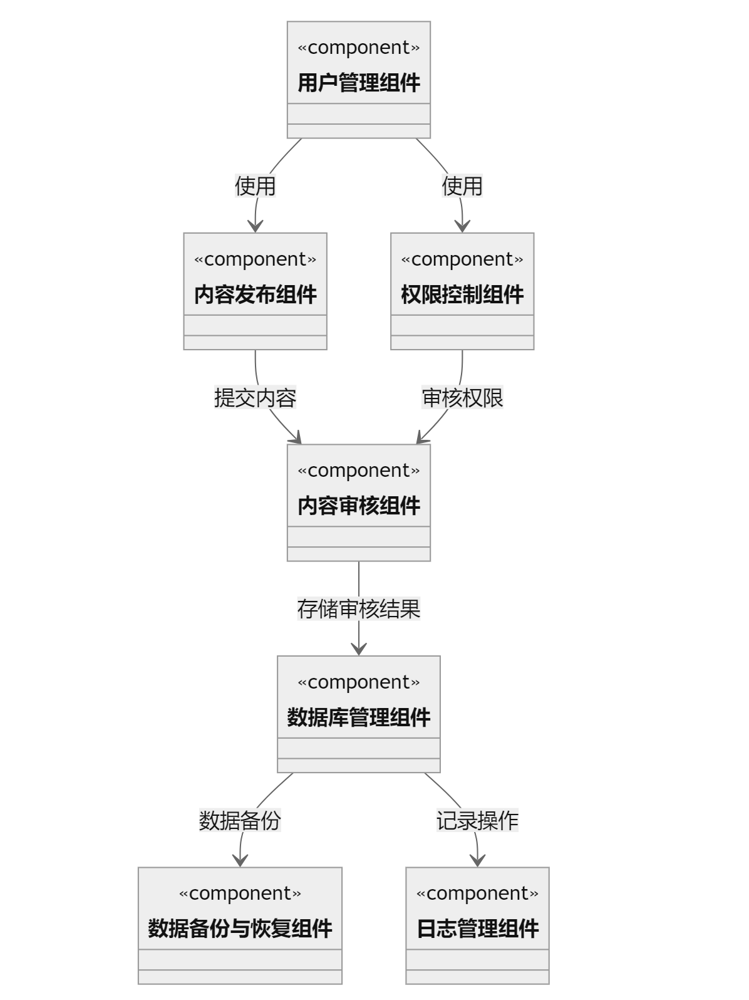
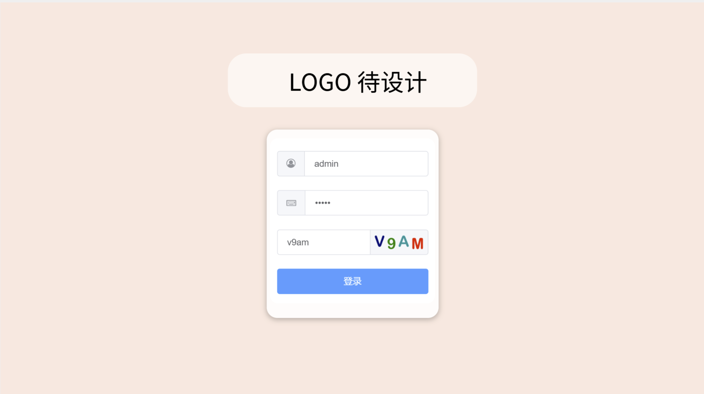

# 设计报告：海外藏中国文物知识管理与服务平台

## **1. 引言**

### **1.1 目的**

本文档的目的是详细描述“海外藏中国文物知识管理与服务平台”项目的概要设计。

该项目包括了从海外博物馆网站爬取中国文物信息、构建知识图谱、提供数据查询与可视化服务等多个子系统的开发。

文档将详细介绍以下方面：

- **系统功能简介**：概述各子系统的基本功能及作用。
- **体系结构设计**：阐述整个平台的架构及各部分之间的交互关系。
- **接口设计**：详细说明各子系统间接口的设计与实现。
- **数据设计**：描述数据爬取、处理、存储的方法及使用的数据库技术。
- **模块设计**：细分各功能模块，解释其内部逻辑与实现细节。
- **界面设计**：展示用户界面的布局、风格及用户交互设计。

本文档的预期读者包括：

- **开发人员**：负责编写代码和实现系统功能。
- **项目管理人员**：负责项目的整体规划与进度控制。
- **测试人员**：负责全面测试系统的功能与性能。

### **1.2 范围**

本文档覆盖了“海外藏中国文物知识管理与服务平台”的概要设计阶段，定义了系统的结构和各单元接口。具体实现方法和技术细节将在后续的详细设计文档中确定。

### **1.3 缩写说明**

- **UML**：Unified Modeling Language，统一建模语言。
- **MVC**：Model-View-Controller，模式-视图-控制器架构。
- **API**：Application Programming Interface，应用程序接口。
- **DB**：Database，数据库。
- **CHA** : China-Heritage-Abroad, 为本软件的简称。

### **1.4 术语定义**

- **知识图谱**：通过爬取和整理数据构建的，用于表示和存储海外中国文物信息的图形数据库。
- **Web爬虫**：自动访问互联网网站并从中抽取信息的程序。

## 2. 总系统设计概述

**CHA服务平台**的设计，采用模块化的主程序/子程序体系结构。

整个平台由一个核心主程序和多个子程序组成，主程序负责调度各子程序并管理它们之间的通信。

**主程序：**负责初始化系统，设置全局配置参数，并根据操作需求调用相应的子程序。

主程序还负责处理子程序之间的数据交换和同步，确保系统运行的高效性和稳定性。

**子程序：**

- 知识图谱构建子系统：负责从指定的海外博物馆网站爬取中国文物信息，并对数据进行加工处理，构建知识图谱。

- 海外文物知识服务子系统：利用知识图谱构建子系统获取的数据，提供数据浏览、查询、可视化等服务。

- 知识问答子系统：使用知识图谱数据或互联网百科数据提供知识问答服务。

- 掌上博物馆：通过手机端App支持文物展示和用户交互功能。

- 后台管理子系统：用于管理系统中的所有数据和用户活动，包括审核用户生成的内容、数据备份与恢复等。

各子程序之间通过定义好的接口进行数据交换和功能调用，主程序协调这些交互以保持系统的整体功能和性能。

**总系统体系结构设计概念图如下**

## 3. 子系统详细设计

### 3.1 知识图谱构建子系统详细设计

- 3.1.1 系统功能简介

1.**数据爬取**:爬取海外博物馆网站的中国文物信息，包括文物名字、文物图片、年代、介绍等信息。按照规定格式保存下载的数据。

2.**数据建模**:将爬取的数据转化为三元组形式，并转化为`csv`格式文件存储到`MySQL`数据库中；将爬取到的图片数据存储到图床中。

3.**数据补充**:根据需要从互联网爬取数据，对现有数据进行补充，如相关数据的基础信息缺失，需要从其他来源进行爬取或人工补充。例如，从百度百科下载数据，补充现有数据，如书画作家信息等。

4.**数据存储**:将根据步骤2中建模好的三元组数据保存到Virtuoso或Neo4j图数据库中，发布成链接开放数据，用于其他小组后续功能开发，并构建海外文物知识图谱。

- 3.1.2 体系结构设计

- 3.1.3 接口设计

- **数据管理 (Data Management)**

  - **数据爬取接口**
    - 博物馆数据爬取接口：接收博物馆网址列表，爬取指定博物馆的中国文物信息。
    - 补充数据爬取接口：根据需要从互联网爬取数据，对现有数据进行补充。

  - **数据处理接口**
    - 数据转化接口：将爬取的数据转化为三元组形式。
    - 数据补充接口：根据需要从其他来源进行爬取或人工补充数据，如从百度百科下载数据补充文物信息。

  - **数据存储接口**
    - 保存到数据库接口：将处理好的三元组数据保存到图数据库（Virtuoso或Neo4j）或关系型数据库（MySQL等）中。
    - 发布链接开放数据接口：将处理好的数据发布成链接开放数据，可用于关系图谱、时间轴等知识图谱可视化、问答等功能开发。

- 3.1.4 数据设计

Mysql数据库的数据设计和后台管理子系统的设计相同。

neo4j数据库的数据设计如下：

- 节点（Nodes）

| 类型         | 字段名称       | 数据类型 | 长度                  | 能否为空 | 能否重复 | 说明                   |
| ------------ | -------------- | -------- | --------------------- | -------- | -------- | ---------------------- |
| 文物节点     | 文物编号       | 数值型   | 15                    | 否       | 否       |                        |
|              | 名称           | 字符型   | 100                   | 否       | 是       | 可视化图中圆圈里面的字 |
|              | 介绍           | 字符型   | 500                   | 是       | 否       |                        |
| 朝代节点     | 朝代名称       | 字符型   | 50                    | 否       | 否       | 可视化图中圆圈里面的字 |
| 作者节点     | 作者名称及介绍 | 字符型   | 100                   | 否       | 否       | 可视化图中圆圈里面的字 |
| 藏品材质节点 | 材质名称       | 字符型   | 50                    | 否       | 否       | 可视化图中圆圈里面的字 |
| 藏品来源节点 | 来源名称       | 枚举型   | 征集购买/接受捐赠等   | 否       | 否       | 可视化图中圆圈里面的字 |
| 藏品等级节点 | 等级名称       | 枚举型   | 一级/二级/三级/未定级 | 否       | 否       | 可视化图中圆圈里面的字 |
| 藏品类型节点 | 类型名称       | 字符型   | 20                    | 否       | 否       | 可视化图中圆圈里面的字 |

- 边（Relationships）

| 关系名称 | 关系类型 | 方向             | 源节点   | 目标节点     | 属性 | 说明             |
| -------- | -------- | ---------------- | -------- | ------------ | ---- | ---------------- |
| 制造于   | 制造于   | 文物 -> 朝代     | 文物节点 | 朝代节点     | 无   | 文物属于某个朝代 |
| 创作者   | 创作者   | 文物 <- 作者     | 文物节点 | 作者节点     | 无   | 文物的作者       |
| 藏品材质 | 藏品材质 | 文物 -> 藏品材质 | 文物节点 | 藏品材质节点 | 无   | 文物的材质       |
| 藏品来源 | 藏品来源 | 文物 -> 藏品来源 | 文物节点 | 藏品来源节点 | 无   | 文物的来源       |
| 藏品等级 | 藏品等级 | 文物 -> 藏品等级 | 文物节点 | 藏品等级节点 | 无   | 文物的等级       |
| 藏品类型 | 藏品类型 | 文物 -> 藏品类型 | 文物节点 | 藏品类型节点 | 无   | 文物的类型       |

- 3.1.5 模块设计

- 3.1.6 界面设计

### 3.2 海外文物知识服务子系统详细设计

- 3.2.1 系统功能简介

==[Todo]==

- 3.2.2 体系结构设计

==[Todo]==

- 3.2.3 接口设计

==[Todo]==

- 3.2.4 数据设计

==[Todo]==

- 3.2.5 模块设计

==[Todo]==

- 3.2.6 界面设计

==[Todo]==

### 3.3 知识问答子系统详细设计

3.3.1 系统功能简介

- **功能描述**：
  - 问答功能：用户通过输入查询相关文物信息，系统从静态数据源中检索相关信息并展示结果。

3.3.2 体系结构设计

- **前端技术**：
  - HTML5 和 CSS3：用于构建响应式和交互式网页。
  - JavaScript（ES6+）：负责前端逻辑处理，包括数据的检索、展示和用户交互。

- **后端技术**：
  - Django：作为轻量级的Web服务器，处理静态文件的服务和基本的路由。
  - Python：用于编写后端逻辑和处理复杂的数据操作。

- **数据存储**：
  - 使用静态 JSON 文件（`data.json`）存储数据，但设计成多个小文件按需加载，优化性能和可管理性。

3.3.3 接口设计

- 无需传统的 RESTful API，通过 Django 配置静态文件直接访问，使用 JavaScript 进行前端数据的拉取和解析。

3.3.4 数据设计

- **数据模型(暂定)**：
  - `data.json`：存储展品的详细信息，每条记录包括 ID、名称、描述、类别、图片 URL 等。

3.3.5 模块设计

- **搜索引擎模块**：
  - 前端 JavaScript 实现一个简易的搜索引擎，能够解析用户的查询请求，进行关键词匹配和结果。

- **展示模块**：
  - 动态内容展示：使用 CSS 动画和 JavaScript 生成内容，提供平滑的用户体验和交互。

3.3.6 界面设计

- **主页**：
  - 设计现代而简洁的界面。
  - 集成一个搜索框，支持关键词高亮和即时回答结果显示。
  - 响应式设计，确保能提供良好的视觉体验。
 
  类似聊天机器人界面设计

 

### 3.4 掌上博物馆子系统详细设计

- 3.4.1 系统功能简介

==[Todo]==

- 3.4.2 体系结构设计

==[Todo]==

- 3.4.3 接口设计

==[Todo]==

- 3.4.4 数据设计

==[Todo]==

- 3.4.5 模块设计

==[Todo]==

- 3.4.6 界面设计

==[Todo]==

### 3.5 后台管理子系统详细设计

- 3.5.1 系统功能简介
  1. **用户管理**：管理后台管理子系统用户、掌上博物馆用户、知识服务子系统用户的基础信息。如：对用户信息的增删查改功能；用户权限的管理，如登录、点赞、评论等用户功能的管理。例如，如果掌上博物馆用户发表不良评论，则停止其发表评论的权限。
  2. **信息审核**：审核用户发表的留言、图片、音视频等内容的功能。对于审核不通过的内容会被屏蔽，同时对该用户进行一定程度惩罚，如禁止发评论等。自动审核功能：对于留言，可以设置敏感词，当用户提交留言出现敏感词时，进行自动屏蔽；对于图片，需要判断是否为不良图片，如果审核不通过，则不显示。人工审核功能：后台管理员或审核人员人工检查用户提交的文本、图片、音视频。
  3. **数据管理**：管理1-3中涉及的所有数据，对所有数据可以进行增删改查等操作，支持单个操作和批量操作。
  4. **数据备份和恢复**：支持数据库的备份和恢复。实现手动备份恢复或定时备份功能。支持查看所有的备份和恢复记录，显示记录时间等相关功能。可通过点击备份记录来将数据库恢复到该备份记录点上。
  5. **日志管理**：查看和检索后台管理子系统的操作日志。记录包括管理员等用户对后台数据的操作记录，数据库的备份还原等记录。

- 3.5.2 体系结构设计

- 3.5.3 接口设计
  - **数据管理 (Data Management)**
    - **查询数据** (`GET /api/data/{type}`)
      - 功能：根据类型查询数据。
      - 参数：数据类型（用户，日志，备份等）。
    - **新增数据** (`POST /api/data`)
      - 功能：添加新数据。
      - 参数：数据类型，数据内容。
    - **删除数据** (`DELETE /api/data/{dataId}`)
      - 功能：删除指定数据。
      - 参数：数据ID。
    - **更新数据** (`PUT /api/data/{dataId}`)
      - 功能：更新指定数据。
      - 参数：数据ID，新的数据内容。

- 3.5.4 数据设计

  

| 表名                   | 字段名称   | 数据类型  | 长度                   | 能否为空 | 能否重复 | 说明                               |
| ---------------------- | ---------- | --------- | ---------------------- | -------- | -------- | ---------------------------------- |
| **统一用户信息表结构** | 用户名     | 字符型    | 15                     | 否       | 否       | 主键                               |
|                        | 邮箱       | 字符型    | 320                    | 否       | 否       | 注册时使用的邮箱                   |
|                        | 密码       | 字符型    | 20                     | 否       | 否       | 密码安全程度检测、使用加密         |
|                        | 用户类型   | 枚举型    | Web端/手机端/管理员    | 否       | 是       | 标识用户所在平台                   |
|                        | 状态       | 枚举型    | 正常/限时封禁/永久封禁 | 否       | 是       | 默认正常                           |
| **文物表结构**         | 文物编号   | 字符型    | 15                     | 否       | 否       | 主键                               |
|                        | 名称       | 字符型    | 100                    | 否       | 是       |                                    |
|                        | 作者       | 字符型    | 15                     | 否       | 是       | 无作者则设为空                     |
|                        | 讲解视频   | BLOB      | LONGBLOB（4GB）        | 是       | 是       | 没有视频就不要这项了               |
|                        | 图片       | BLOB      | MEDIUMBLOB（16MB）     | 是       | 是       | 每个文物一张图，多张需要修改表结构 |
|                        | 年代       | 字符型    | 10                     | 否       | 否       | 使用自带的时间类型无法满足要求     |
|                        | 介绍       | 字符型    | 500                    | 是       | 是       |                                    |
|                        | 类型       | 字符型    | 20                     | 否       | 是       | 为文物设置类型                     |
|                        | 点赞数收藏 | 数值型    | 自行设置               | 否       | 是       | 点赞为手机端操作，收藏为Web端操作  |
| **用户浏览记录表结构** | 用户名     | 字符型    | 15                     | 否       | 否       | 外键表统一用户信息表               |
|                        | 文物编号   | 字符型    | 15                     | 否       | 否       | 外键表文物表                       |
|                        | 时间       | TIMESTAMP |                        | 否       | 是       |                                    |
| **用户收藏记录表结构** | 用户名     | 字符型    | 15                     | 否       | 否       | 外键表统一用户信息表               |
|                        | 文物编号   | 字符型    | 15                     | 否       | 否       | 外键表文物表                       |
| **用户评论记录表结构** | 用户名     | 字符型    | 15                     | 否       | 否       | 外键表统一用户信息表               |
|                        | 文物编号   | 字符型    | 15                     | 否       | 否       | 外键表文物表                       |
|                        | 评论       | 字符型    | 500                    | 否       | 是       | 字数上限可调整                     |
|                        | 是否展示   | 布尔型    | 1                      | 否       | 是       | 默认为0，审核通过后设为1           |
| **内容审核记录表**           | 审核编号         | 数值型      | 自行设置             | 否      | 否      | 主键，自增                             |
|                              | 用户名           | 字符型      | 15                   | 否      | 否      | 外键表统一用户信息表                   |
|                              | 内容类型         | 枚举型      | 文本/图片/视频       | 否      | 是      | 审核内容的类型                          |
|                              | 审核结果         | 布尔型      | 1                    | 否      | 是      | 审核是否通过，通过为1，不通过为0        |
|                              | 审核时间         | TIMESTAMP   |                      | 否      | 是      | 记录审核的时间                          |
|                              | 审核员           | 字符型      | 15                   | 否      | 否      | 审核人员的用户名，外键表管理员信息表     |
| **数据备份记录表**           | 备份编号         | 数值型      | 自行设置             | 否      | 否      | 主键，自增                             |
|                              | 备份时间         | TIMESTAMP   |                      | 否      | 否      | 备份执行的时间                          |
|                              | 备份文件路径     | 字符型      | 100                  | 否      | 否      | 备份文件存储的路径                      |
|                              | 操作员           | 字符型      | 15                   | 否      | 否      | 执行备份操作的管理员，外键表管理员信息表 |
| **日志管理表**               | 日志编号         | 数值型      | 自行设置             | 否      | 否      | 主键，自增                             |
|                              | 操作员           | 字符型      | 15                   | 否      | 否      | 执行操作的管理员，外键表管理员信息表     |
|                              | 操作类型         | 枚举型      | 添加/删除/修改/备份  | 否      | 是      | 执行的操作类型                          |
|                              | 操作时间         | TIMESTAMP   |                      | 否      | 是      | 操作执行的时间                          |
|                              | 操作描述         | 字符型      | 200                  | 是      | 是      | 操作的详细描述                          |

- 3.5.5 模块设计

- 3.5.6 界面设计

